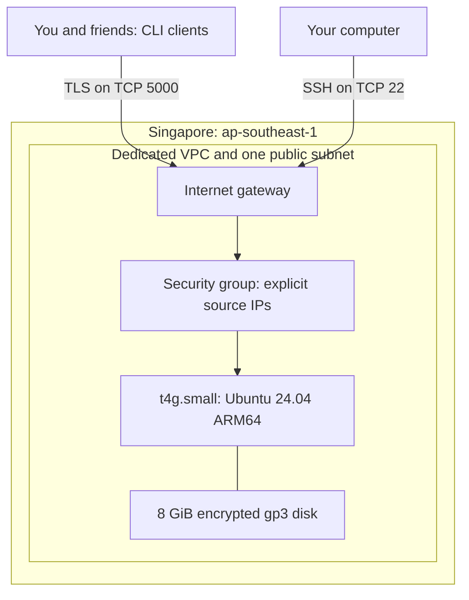

# NEON / CHAT

A Python TCP chat app with a neo-cyberpunk terminal interface. Connect multiple
clients, choose an alias, and chat in a password-protected room with cyan and
magenta accents. Connections use verified TLS encryption.

```text
  ◈  NEON / CHAT    TCP TERMINAL
     A little signal in the noise.
────────────────────────────────────────────────────────
  ● ONLINE / TLS  localhost:5000  /  Raven

  21:31  ◇  Nova has joined the chat
  21:31  Raven  ›  Anyone out there?
  21:31  Nova   ›  Loud and clear.

  you ❯
```

*Illustrative terminal preview; colors depend on your terminal.*

## Features

- **Shared chat:** the server broadcasts messages to connected clients, including
  the sender.
- **Encrypted connections:** TLS 1.2 or newer with certificate and hostname
  verification; no plaintext fallback.
- **Room password:** a masked, history-free login prompt; only authenticated
  clients receive messages. Passwords must be at least 16 characters on the server.
- **User aliases:** choose a display name before entering the room.
  Aliases use 1–24 letters, numbers, underscores, or hyphens and are unique while
  connected (case-insensitive).
- **Presence notices:** see when someone joins or when the server detects a
  closed connection.
- **Neon interface:** styled welcome screen, highlighted senders, local receive
  timestamps, and a compact status bar on compatible terminals.
- **Live input:** incoming messages appear above the composer while you type.
  Submitted input clears so the server echo supplies a single transcript entry.
- **Input history:** use Up/Down to recall earlier input and Enter to send.
- **Clean exits:** `/quit` or Ctrl+D leaves; a closed server connection cancels
  the active input prompt.
- **Protocol safeguards:** length-prefixed messages, bounded queues, login
  timeouts, and limits on login attempts and message bursts.
- **Monochrome option:** prefix your client command with `NO_COLOR=1`.

## Run locally

You need Python 3.11+, OpenSSL (for generating certificates), and `prompt_toolkit`.
From the project directory on Linux or macOS:

```bash
python -m venv .venv
source .venv/bin/activate
python -m pip install -r requirements.txt
python tools/generate_certificate.py
python server.py --cert certs/server.crt --key certs/server.key
```

Enter a shared room password of at least 16 characters at the hidden server
prompt. In another terminal, activate the same environment and start a client:

```bash
source .venv/bin/activate
python client.py --host localhost --ca certs/server.crt
```

Enter an alias and the same room password. Repeat in additional terminals to
chat between clients. This setup binds the server to `127.0.0.1:5000`.

The generated certificate covers `localhost` and `127.0.0.1`, expires after
seven days, and is trusted explicitly through `--ca`. The helper refuses to
overwrite an existing certificate or key. Use a new `--out` directory to renew,
then update the server and client paths.

For friends connecting over the internet, follow the
[AWS EC2 deployment guide](deploy/AWS.md). A reproducible
[CloudFormation template](deploy/stack.json) prepares the infrastructure and
bootstraps the room. The Singapore stack was deployed and externally verified
on **September 23, 2026**: TLS verification, rejected wrong passwords, two-client
messaging, and `/quit` all passed. Availability follows the session lifecycle;
the instance automatically stops after roughly three hours.

## AWS architecture

The hosting target is **Asia Pacific (Singapore), `ap-southeast-1`**, with one
server that runs only during chat sessions.



| Component | Configuration |
| --- | --- |
| Compute | One `t4g.small`, standard CPU credit mode |
| Operating system | Ubuntu 24.04 ARM64, resolved from Canonical's public AMI parameter |
| Storage | 8 GiB encrypted gp3 root disk, deleted on instance termination |
| Network | Public subnet, internet gateway, auto-assigned public IPv4 |
| Firewall | SSH from the administrator's `/32`; chat initially from the same IP, with friends added explicitly |
| Server | Pinned application revision, systemd service, TLS, shared room password |
| Secrets | Random room password and private key on the instance; neither is a stack output |
| Session limit | Instance automatically stops about three hours after its timer starts on each boot |

The template creates no load balancer, NAT gateway, database, or Elastic IP.
Messages stay in memory. This single-server design accepts downtime if the
instance stops or fails.

At startup, the room generates a seven-day certificate for the instance's current
public IP. Retrieve its **public certificate** again after a restart; the private
key stays on the instance. A new public IP may be assigned after a stop/start.
The shared password persists on the encrypted disk until you rotate it or delete
the instance. The AWS guide explains retrieving it privately and inviting friends.

### Running costs

Planning estimates checked September 23, 2026, for one server, one public IPv4,
an 8 GiB disk retained all month, and light text traffic:

| Runtime per month | With T4g compute trial | Without compute trial, at estimated current rates |
| --- | --- | --- |
| 100 hours | About $1–$2 | About $3–$4 |
| 730 hours | About $4–$5 | About $20 |

AWS currently advertises 750 aggregate `t4g.small` instance hours per month
through **December 31, 2026**, including Singapore. Storage and public IPv4 are
separate charges. IPv4 costs $0.005/hour; allow roughly $1/month for this disk.
Estimates exclude taxes, excess transfer, and optional resources. Promotional
credits may cover eligible usage while valid; they do not make hosting free
indefinitely. Confirm the regional quote and eligibility before launch.

Stop the **EC2 instance** after chatting; `/quit` only disconnects a client.
Storage still accrues charges while stopped. The three-hour timer is a runtime
guard, not a billing cap. Configure a $5 budget alert separately; alerts are not
created by the template and do not automatically stop spending.

Sources: [AWS T4g trial](https://aws.amazon.com/ec2/faqs/),
[IPv4 pricing](https://aws.amazon.com/vpc/pricing/),
[EBS pricing](https://aws.amazon.com/ebs/pricing/),
[Singapore compute estimate](https://calculator.holori.com/aws/ec2/t4g.small?os=Linux&region=ap-southeast-1&upfront=no-upfront).

## Our development process

We are building the app in small steps, starting with the networking fundamentals
and then improving the experience around them.

| Stage | What we built | Progress |
| --- | --- | --- |
| TCP foundation | Socket connection, sending bytes, and receiving text | Implemented |
| Multiple clients | Shared client registry and broadcast messages; now served by async tasks | Implemented |
| Room identity | Aliases and join/leave notices | Implemented |
| Terminal design | Separate UI module, neon theme, timestamps, and message composer | Implemented |
| Visual refinement | Clear submitted input to avoid showing it twice | Implemented |
| Protocol reliability | Length-prefixed JSON, bounded messages, and clean disconnects | Implemented |
| Private room access | Verified TLS, shared password, and login/message limits | Implemented; local integration tests |
| AWS hosting | Singapore CloudFormation stack, automatic setup, and session auto-stop | Deployed; external TLS, authentication, chat, and quit checks passed |

The interface lives in `chat_ui.py`. The initial visual updates left the socket
code unchanged. The security phase adds `transport.py` for TLS/login and
`framing.py` for message boundaries, and moves networking to `asyncio` streams so
input, receiving, and client connections can run concurrently. Security and
protocol checks use real local TLS connections and temporary test certificates.

We keep supporting learning notes in [learning/lessons](learning/lessons), with a
[development log](learning/progress/learning-log.md) and a
[knowledge tracker](learning/progress/knowledge-tree.md).

## Current limitations

This is a small friends-only prototype, not an audited public chat service.
TLS protects traffic between clients and the server; the server can read the
messages, so this is not end-to-end encryption. Anyone with the shared password
can join and choose an available alias. There are no permanent user accounts,
automatic reconnection, or saved chat history. Terminal output can still be
retained by participants.

The server allows 32 connections after TLS negotiation, 10 login attempts per IP
per minute (including successful attempts), and 20 messages per client per ten
seconds. Messages can contain at most 4000 UTF-8 bytes. These limits are not
comprehensive denial-of-service protection. Old plaintext clients are incompatible
with this protocol; everyone needs the updated client.

## Project layout

```text
client.py        Login, concurrent sending/receiving, and clean exits
server.py        Authenticated room, limits, and broadcasting
chat_ui.py       Terminal theme, prompts, and message rendering
transport.py     Verified TLS contexts and authentication handshake
framing.py       Bounded, length-prefixed JSON messages
tests/           Protocol, authentication, and TLS integration tests
deploy/          AWS instructions and optional systemd service
learning/        Networking lessons and progress notes
tools/           Certificate helper and learning-guide scripts
```

## Verification

Run the automated checks (OpenSSL must be installed):

```bash
python -m unittest discover -s tests -v
```

With a local server running, test five clients sending and receiving over TLS:

```bash
python test_clients.py --host localhost --ca certs/server.crt
```

Enter the room password when prompted. Repeated runs share the per-IP login
budget; wait one minute if it is exhausted.
