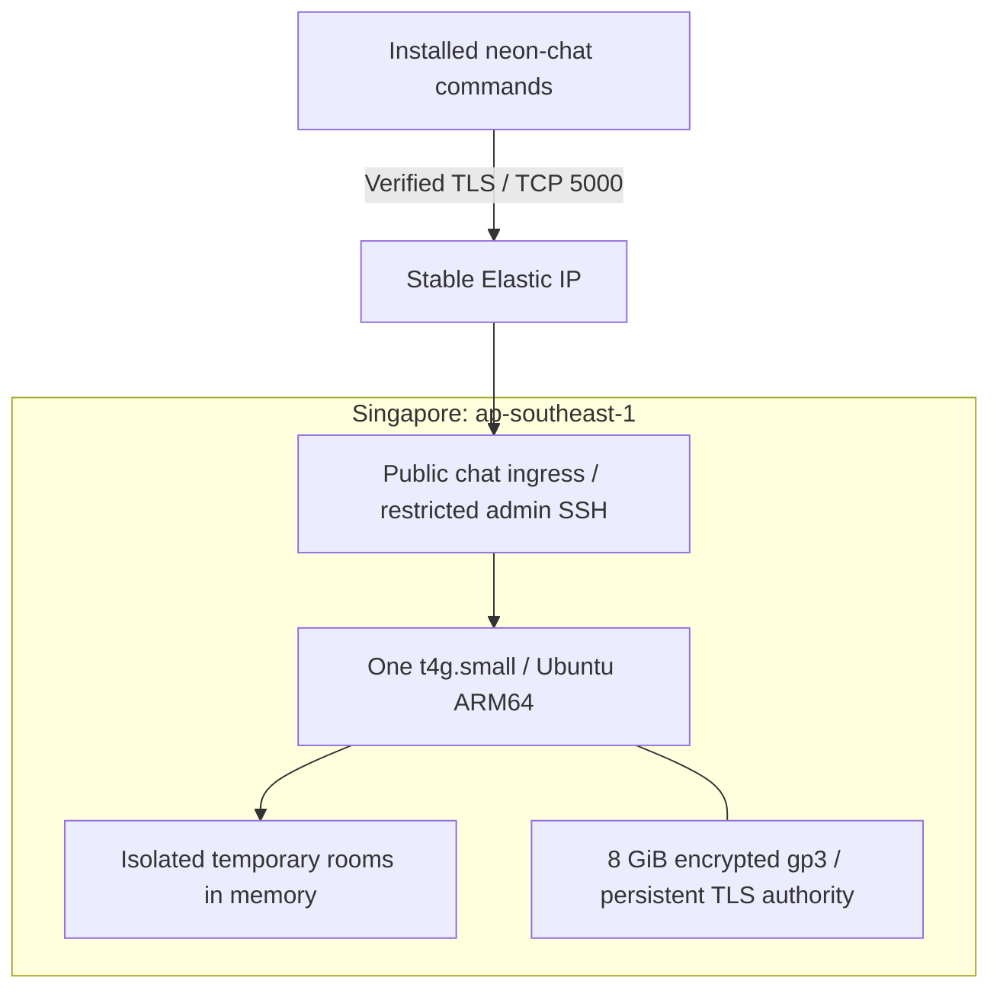

# NEON / CHAT

A Python TCP chat app with a neo-cyberpunk terminal interface. Connect multiple
clients, create a temporary room, and invite friends with a code. The interface
uses cyan and magenta accents. Connections use verified TLS encryption.

```text
  ◈  NEON / CHAT    TCP TERMINAL
     A little signal in the noise.
────────────────────────────────────────────────────────
  ● ONLINE / TLS  localhost:5000  /  Raven

  21:31  ◇  Nova has joined the chat
  21:31  Raven  ›  Anyone out there?
  21:31  Nova   ›  Loud and clear.

  you ❯
```

*Illustrative terminal preview; colors depend on your terminal.*

[Open the animated installation guide](https://ryanmyatthu-dev.github.io/TCP-Chat/)

## Install and chat

Install [uv](https://docs.astral.sh/uv/getting-started/installation/) once, then:

```bash
curl -fsSL https://raw.githubusercontent.com/RyanMyatThu-dev/TCP-Chat/main/web/public/install.sh | sh
```

The installer shows the ASCII NEON logo, installs the app, and prints host/join
commands after success. It runs the repository's shell script; you can inspect
[the installer](web/public/install.sh) before running it. On Windows, use PowerShell:

```powershell
irm https://raw.githubusercontent.com/RyanMyatThu-dev/TCP-Chat/main/web/public/install.ps1 | iex
```

For a direct install without the banner, use:

```bash
uv tool install --python 3.12 https://github.com/RyanMyatThu-dev/TCP-Chat/archive/refs/heads/main.zip
```

Open a new terminal if `neon-chat` is not on your PATH (or run `uv tool update-shell`).
This installs the command in its own environment; no repository checkout is needed.
The package is distributed from this repository, not published on PyPI.

Create a room:

```bash
neon-chat host
```

Choose your alias. The app displays a private invitation such as `ABCD-1234-EFGH`.
Your friends install the same app and run the command you share:

```bash
neon-chat join ABCD-1234-EFGH
```

Anyone with the app can create a room. No AWS account, address, certificate file,
or separate room password is needed. The code grants access: share it privately.
The service address and public trust certificate are included in the package.
The AWS service must be running; friends cannot start the instance themselves.

- `/invite` shows the invitation again.
- `/quit`, Ctrl+D, or Ctrl+C leaves.
- When the host disconnects, guests disconnect and the code expires.
- Guest departures leave the room open. A new host session gets a new code.
- `--name Raven` skips the alias prompt; `NO_COLOR=1 neon-chat host` disables color.

To update, rerun the installer. For the direct uv command, add `--reinstall`.

## Features

- **Temporary invitation rooms:** independent rooms, cryptographically random
  12-character codes, and automatic cleanup when their host leaves.
- **Verified TLS:** encrypted client/server connections with certificate and IP
  verification. The persistent authority allows server certificates to renew
  without redistributing files to friends.
- **Neon terminal:** cyan/magenta theme, receive timestamps, presence notices,
  highlighted senders, and a status bar.
- **Live composer:** incoming messages appear while you type; submitted input
  clears so each message appears once. Up/Down recalls your input.
- **Aliases:** 1–24 letters, numbers, underscores, or hyphens; case-insensitive
  uniqueness within each room.
- **Bounded service:** room, connection, message, and per-IP login limits.
- **Learning mode:** the original shared-password client remains available for
  local networking exercises.

## Run locally

You need Python 3.11+, OpenSSL (for generating certificates), and `prompt_toolkit`.
From the project directory on Linux or macOS:

```bash
python -m venv .venv
source .venv/bin/activate
python -m pip install -r requirements.txt
python tools/generate_certificate.py
python server.py --cert certs/server.crt --key certs/server.key
```

Enter a shared room password of at least 16 characters at the hidden server
prompt. In another terminal, activate the same environment and start a client:

```bash
source .venv/bin/activate
python client.py --host localhost --ca certs/server.crt
```

Enter an alias and the same room password. Repeat in additional terminals to
chat between clients. This setup binds the server to `127.0.0.1:5000`.

The generated certificate covers `localhost` and `127.0.0.1`, expires after
seven days, and is trusted explicitly through `--ca`. The helper refuses to
overwrite an existing certificate or key. Use a new `--out` directory to renew,
then update the server and client paths.

For the hosted command, use the installation steps above. Operators can follow
[the AWS deployment guide](deploy/AWS.md) to manage the service.

## AWS architecture



| Component | Configuration |
| --- | --- |
| Compute | One `t4g.small`, standard CPU credits, Ubuntu 24.04 ARM64 |
| Network | Dedicated VPC, public subnet, internet gateway, stable Elastic IP |
| Firewall | Public TCP 5000 for invitation rooms; TCP 22 only from administrator `/32` |
| Identity | Private CA/key on the instance; public CA bundled with installed clients |
| TLS renewal | Seven-day server certificate renewed on every service start |
| Lifecycle | Host departure closes its room; server stop closes every room |
| Runtime | Instance auto-stops about three hours after its timer starts on each boot |

No load balancer, NAT gateway, database, or message persistence. A single server
means downtime when it stops or fails. The authority and address survive normal
stop/start, so clients keep working without reconfiguration when service resumes.
Deleting the stack deletes the disk and releases the address; clients must be
updated after redeployment to a different address or authority.

### Running costs

Approximate monthly costs for light text traffic, a retained address and 8 GiB disk:

| Runtime | With T4g compute trial | Without compute trial |
| --- | --- | --- |
| 100 hours | $4–$5 | $6–$7 |
| 730 hours | $4–$5 | About $20 |

The stable IPv4 costs **$0.005/hour (~$3.65/month), even while stopped**;
allow roughly $1/month for disk. AWS advertises 750 aggregate `t4g.small` hours
monthly through December 31, 2026, including Singapore. Check eligibility and
credit expiry in Billing. Estimates exclude taxes, excess transfer and optional
resources. The timer limits runtime, not total spending. Budget alerts are not
created by the template and do not automatically stop spending.

Sources: [AWS T4g trial](https://aws.amazon.com/ec2/faqs/),
[IPv4 pricing](https://aws.amazon.com/vpc/pricing/),
[EBS pricing](https://aws.amazon.com/ebs/pricing/).

## Our development process

We are building the app in small steps, starting with the networking fundamentals
and then improving the experience around them.

| Stage | What we built | Progress |
| --- | --- | --- |
| TCP foundation | Socket connection, sending bytes, and receiving text | Implemented |
| Multiple clients | Shared client registry and broadcast messages; now served by async tasks | Implemented |
| Room identity | Aliases and join/leave notices | Implemented |
| Terminal design | Separate UI module, neon theme, timestamps, and message composer | Implemented |
| Visual refinement | Clear submitted input to avoid showing it twice | Implemented |
| Protocol reliability | Length-prefixed JSON, bounded messages, and clean disconnects | Implemented |
| Private room access | Verified TLS, shared password, and login/message limits | Implemented; local integration tests |
| AWS hosting | Singapore CloudFormation stack, stable address, and session auto-stop | Deployed |
| Simple invitations | Installable command, isolated rooms, host/join codes | Implemented; automated room lifecycle tests |

The interface lives in `chat_ui.py`. The initial visual updates left the socket
code unchanged. The security phase adds `transport.py` for TLS/login and
`framing.py` for message boundaries, and moves networking to `asyncio` streams so
input, receiving, and client connections can run concurrently. Security and
protocol checks use real local TLS connections and temporary test certificates.

We keep supporting learning notes in [learning/lessons](learning/lessons), with a
[development log](learning/progress/learning-log.md) and a
[knowledge tracker](learning/progress/knowledge-tree.md).

## Current limitations

This is a small friends-only prototype, not an audited public chat service.
TLS protects traffic between clients and the server; the server can read the
messages, so this is not end-to-end encryption. Anyone with a room code can join that room and choose an available alias.
There is no permanent identity verification or room ownership recovery. There are no permanent user accounts,
automatic reconnection, or saved chat history. Terminal output can still be
retained by participants.

The server allows 8 simultaneous invitation rooms, 3 creations per IP per minute,
32 connections after TLS negotiation, and 10 login attempts per IP
per minute (including successful attempts), and 20 messages per client per ten
seconds. Messages can contain at most 4000 UTF-8 bytes. These limits are not
comprehensive denial-of-service protection. Old plaintext clients are incompatible
with this protocol; everyone needs the updated client.

## Project layout

```text
client.py        Login, concurrent sending/receiving, and clean exits
server.py        Isolated rooms, host lifecycle, limits, and broadcasting
neon_chat/       Installed command, service address, and public trust certificate
room_codes.py    Random invitation codes and normalization
chat_ui.py       Terminal theme, prompts, and message rendering
transport.py     Verified TLS contexts and authentication handshake
framing.py       Bounded, length-prefixed JSON messages
tests/           Protocol, authentication, and TLS integration tests
deploy/          AWS instructions and optional systemd service
learning/        Networking lessons and progress notes
tools/           Certificate helper and learning-guide scripts
```

## Verification

Run the automated checks (OpenSSL must be installed):

```bash
python -m unittest discover -s tests -v
```

With a local server running, test five clients sending and receiving over TLS:

```bash
python test_clients.py --host localhost --ca certs/server.crt
```

Enter the room password when prompted. Repeated runs share the per-IP login
budget; wait one minute if it is exhausted.

## React installation guide

The guide lives in `web/`: React, TypeScript, and Vite; solid-color styling,
hover interactions, cursor tracking, and reduced-motion support. It builds static
files to `docs/` for GitHub Pages, independently of the temporary AWS chat server.

```bash
cd web
npm ci
npm run dev
npm run build
npm exec playwright install chromium
npm test
```

To publish an update, run `npm run build:pages` from `web/` and commit `docs/`
with the source. GitHub Pages serves the main branch's `/docs` directory.
